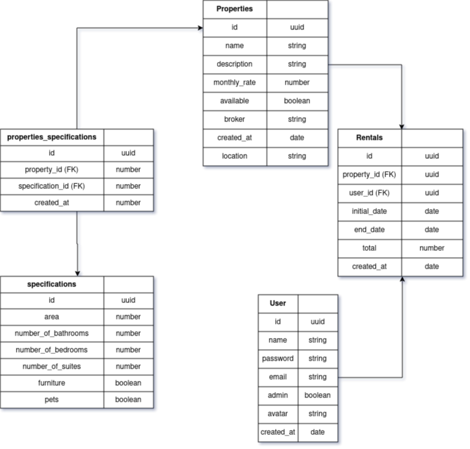

<h1 align="center">Backend com NodeJS e Express</h1>

O objetivo do projeto é desenvolver um backend utilizando [NodeJS](https://nodejs.org/en/) com [Express](https://expressjs.com/pt-br/) e [Typescript](https://www.typescriptlang.org/) para uma plataforma de aluguéis de imóveis, uma versão mais básica, em termos de funcionalidades, do que a [Quinto Andar](https://www.quintoandar.com.br/) oferece.

## Esboço do projeto

## Features em desenvolvimento
> 18/11/21 a 23/11/21
> - [x] Setup inicial do projeto
> - [x] Criação das primeiras rotas para criar imóveis e listar os existentes
> - [x] Criação das primeiras rotas para criar as especificações referente a uma propriedade

____

>23/11/21 a 30/11/21
> - [x] Criação da tabela de usuários com senhas criptografadas
> - [x] Autenticação de usuário via token
> - [x] Iniciar documentação usando Swagger
> - [ ] Listagem de propriedades por disponibilidade/endereço